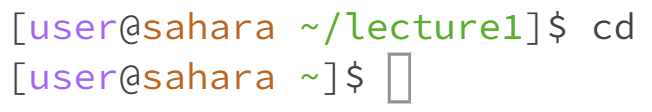

# Lab 1

---
## Using `cd` Command

- No arguments

  
  - The working directory was `/home/lecture1` when this command was run.
  - As shown above, this command produces no output. This is because to properly use the `cd` command, you must follow it with a directory as an argument. Having no argument means there is no directory to change to, thus nothing changes.  

- A path to a *directory* as an argument

- A path to a *file* as an argument

---
## Using `ls` Command

no arguments
a path to a *directory* as an argument

a path to a *file* as an argument

---
## Using `cat` Command

no arguments

a path to a *directory* as an argument

a path to a *file* as an argument
