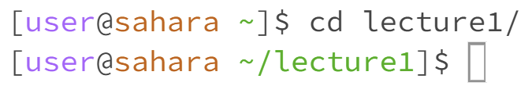

# Lab 1

---
## Using `cd` Command

- No arguments
 
  
  - The working directory was `/home/lecture1` when this command was run.
  - As shown above, this command produces no output but does change the working directory to `/home`. This is because the `cd` command is used to change the current working directory to the path given as an argument. When `cd` is run while having no argument, we are returned to the home directory `/home` and no output is given.
  - No error occurred.

- A path to a *directory* as an argument

  
  - The working directory was `/home` when this command was run.
  - As shown above, this command produces no ouput, but does change the prompt and the working directory. Using the path to the `lecture1` folder as an argument for the `cd` command changes the working directory from `/home` to `/home/lecture1`. In addition, the prompt changed to `[user@sahara ~/lecture1]$` to remind us of the terminals new directory.
  - No error occurred.

- A path to a *file* as an argument
  
  
  - The working directory was `/home/lecture1` when this command was run.
  - As shown above, this command produces the output `bash: cd: messages/en-us.txt: Not a directory`. `en-us.txt` is a file within the `messages` folder which itself is within the `lecture1` folder. So, this output is tells us that `messages/en-us.txt` is not a path to a directory, but rather a path to a file. Thus, using it as an argument for the `cd` command will not work.
  - This output is an error. You must follow a `cd` command with an argument that is a path to a directory. However, `en-us.txt` is a file, not a directory. Therefore, this command produces the error shown above.

---
## Using `ls` Command

- No arguments
  
  
  - The working directory was `/home/lecture1` when this command was run.
  - As shown above, this command produces the output `Hello.class  Hello.java  **messages**  README`. Using the `ls` command with no arguments lists out all the folders and files in the working directory. Since our current working directory is `/home/lecture1`, everything within the `lecture1` folder is listed including `Hello.class`, `Hello.java`, `README`, and `messages` (which is bolded because its a subdirectory).
  - No error occurred.
  
- A path to a *directory* as an argument
  
  
  - The working directory was `/home/lecture1` when this command was run.
  - As shown above, this command produces the output `en-us.txt  es-mx.txt  fr.txt  zh-cn.txt`. Using the path to the `messages` folder as an argument for the `ls` command lists out all the files within the folder, which includes `en-us.txt`, `es-us.txt`, `fr.txt`, `zh-cn/txt` which is why they are all visible in the output.
  - No error occurred.
  
- A path to a *file* as an argument
  
  
  - The working directory was `/home/lecture1` when this command was run.
  - As shown above, this command produces the output `messages/en-us.txt`. Using a path to a file (in this case the `en-us.txt` file) as an argument for the `ls` command causes the output to just repeat the path used (in this case `messages/en-us.txt`).
  - No error occurred.
    
---
## Using `cat` Command

- No arguments
  
  
  - The working directory was `/home/lecture1` when this command was run.
  - As shown above, this command produces no output. This is because `cat` is used to print the contents of a file. However no argument (or path to a file) is used, thus there is nothing to print. In addition, the `cat` command is now taking input rather than the terminal.
  - No error occurred.
   
- A path to a *directory* as an argument

  
  - The working directory was `/home/lecture1` when this command was run.
  - As shown above, this command produces the output `cat: messages/: Is a directory`. This is because `cat` is used to print the contents of a file. However, the path given as an argument is a path to a directory. Thus, the output tells us that the path we used is a directory and not a file, so it can't print any contents.
  - This ouput is an error. The `cat` command needs a path to a file as an argument so that it can print out that files contents. Since we use a path to a directory instead, it causes an error.

- A path to a *file* as an argument
  
  
  - The working directory was `/home/lecture1` when this command was run.
  - As shown above, the command produces the output `Hello World!`. This is because the path to the `en-us.txt` file was used as an argument for the `cat` command, thus the contents of the `en-us.txt` (which is the text `Hello World!`) file will be printed as the output.
  - No error occurred.

  
