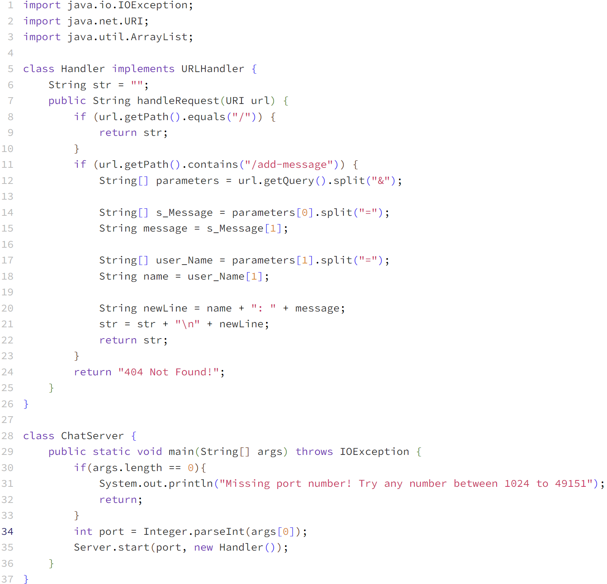
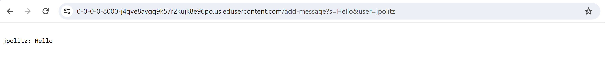
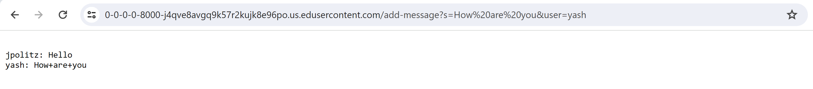
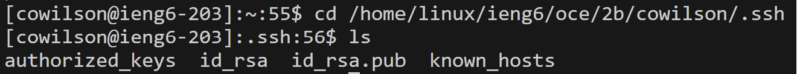
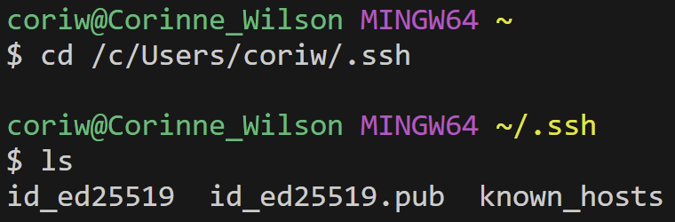
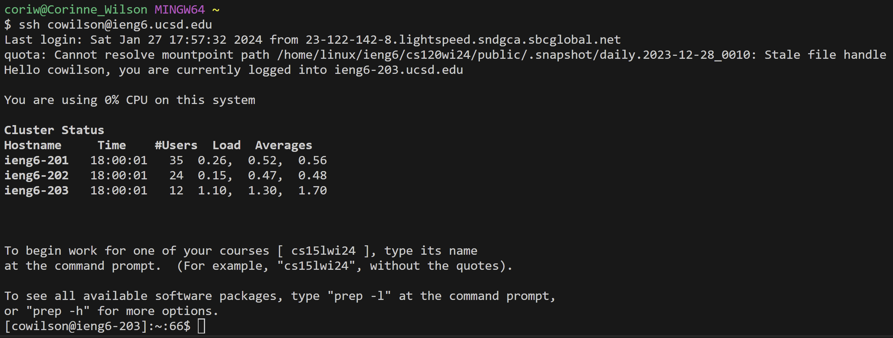

# Lab 2
---
## Part 1
- `ChatServer` code

  
---

**Message 1**
  

  - `String str = ""`
    - The field str is set to the empty string. 
  - `handleRequest(URI url)`
    - `https://0-0-0-0-8000-j4qve8avgq9k57r2kujk8e96po.us.edusercontent.com/add-message?s=Hello&user=jpolitz` is passed in as an argument for the url.
  - `url.getPath().equals("/")`
    - `"/"` is passed in as an argument for the equals method.  
    - `url.getPath()` equals the string `"/add-message"`, so this if statement is bypassed.
  - `url.getPath().contains("/add-message")`
    - `"/add-message"` is passed in as an argument for the contains method.
    - `url.getPath()` equals the string `"/add-message"` so the if conditional is true and the code inside the if statement will be executed.
  - String[] parameters = url.getQuery().split("&")`
    - `url.getQuery()` equals the string `"s=Hello&user=jpolitz"` from the end of the url after the `?`.
    - `split("&")` splits this string between the character `&` into an Array of strings with 2 elements, `{"s=Hello", "user=jpolitz"}`.
      - `"&"` is passed in as an argument for the split method.
    -  The field `parameters` is then set to the value of this Array, `{"s=Hello", "user=jpolitz"}`.
      
  - `String[] s_Message = parameters[0].split("=")`
    - `parameters[0]` equals the first string in the `parameters` Array, which is `"s=Hello"`.
    - `split("=")` splits this string on either side of the character "=" into another Array of strings, `{"s", "Hello"}`.
      - `"="` is passed in as an argument for the splits method.  
    - The field `s_Message` is then set to the value of this Array, `{"s", "Hello"}`.
  - `String message = s_Message[1]`
    - This sets the field message to the second value in the `s_Message` Array, which is the string `"Hello"`.
  
  - `String[] user_Name = parameters[1].split("=")`
    - `parameters[1]` equals the second string in the `parameters` Array, which is `"user=jpolitz"`.
    - `split("=")` splits this string on either side of the character "=" into another Array of strings, `{"user", "jpolitz"}`.
      - `"="` is passed in as an argument for the splits method.
    - The field `user_Name` is then set to the value of this Array, `{"user", "jpolitz"}`.
  - `String name = user_Name[1]`
    - This sets the field name to the second value in the `user_Name` Array, which is the string `"jpolitz"`.

  - `String newLine = name + ": " + message`
    - This line combines the `name` and `message` field into one string, and sets the field `newLine` as this value.
    - `name + ": " + message` equals `"jpolitz: Hello"`.
  - `str = str + "\n" + newLine;`
    - This adds the `newLine` string we created earlier to the string `str`
    - So `str` changes to `"jpolitz: Hello"`.   
  - `return str`
    - The string is returned to be displayed on the page.
---

**Message 2**
  
  - `handleRequest(URI url)`
    - `https://0-0-0-0-8000-j4qve8avgq9k57r2kujk8e96po.us.edusercontent.com/add-message?s=How%20are%20you&user=yash` is passed in as an argument for the url.
  - `url.getPath().equals("/")`
    - `"/"` is passed in as an argument for the equals method.  
    - `url.getPath()` equals the string `/add-message`, so this if statement is bypassed.
  - `url.getPath().contains("/add-message")`
    - `"/add-message"` is passed in as an argument for the contains method.
    - `url.getPath()` equals the string `"/add-message"` so the if conditional is true and the code inside the if statement will be executed.
  - String[] parameters = url.getQuery().split("&")`
    - `url.getQuery()` equals the string `"s=How are you&user=yash"` from the end of the url after the `?`.
    - `split("&")` splits this string between the character `&` into an Array of strings with 2 elements, `{"s=How are you", "user=yash"}`.
      - `"&"` is passed in as an argument for the split method.
    -  The field `parameters` is then set to the value of this Array, `{"s=How are you", "user=yash"}`.
      
  - `String[] s_Message = parameters[0].split("=")`
    - `parameters[0]` equals the first string in the `parameters` Array, which is `"s=How are you"`.
    - `split("=")` splits this string on either side of the character "=" into another Array of strings, `{"s", "How are you"}`.
      - `"="` is passed in as an argument for the splits method.  
    - The field `s_Message` is then set to the value of this Array, `{"s", "How are you"}`.
  - `String message = s_Message[1]`
    - This sets the field message to the second value in the `s_Message` Array, which is the string `"How are you"`.
  
  - `String[] user_Name = parameters[1].split("=")`
    - `parameters[1]` equals the second string in the `parameters` Array, which is `"user=yash"`.
    - `split("=")` splits this string on either side of the character "=" into another Array of strings, `{"user", "yash"}`.
      - `"="` is passed in as an argument for the splits method.
    - The field `user_Name` is then set to the value of this Array, `{"user", "yash"}`.
  - `String name = user_Name[1]`
    - This sets the field name to the second value in the `user_Name` Array, which is the string `"yash"`.

  - `String newLine = name + ": " + message`
    - This line combines the `name` and `message` field into one string, and sets the field `newLine` as this value.
    - `name + ": " + message` equals `"yash: How are you"`.
  - `str = str + "\n" + newLine;`
    - This adds the `newLine` to the current value of str `"jpolitz: Hello"`
    - So `str` changes to
      ```
      "jpolitz: Hello
      yash: How are you"
      ```
  - `return str`
    - The string is returned to be displayed on the page.
---

## Part 2
- Absolute Path to Public Key
  
  
  - As you can see the absolute path to my public key is `/home/linux/ieng6/oce/2b/cowilson/.ssh/authorized_keys`.
---

- Absolute Path to Private Key
  
  
  - As you can see the absolute path to my private key is `/c/Users/coriw/.ssh/id_ed25519`.
---

 - Logging In Without a Password

   
   
---

## Part 3
- Something New I Learned
  - In our Week 2 Lab my favorite thing I learned about was writing programs that take in a webservers URL as input, and change the text on the page based on the urls path and query. Taking the path, something like "/add", and a query, something like "s=apple" you can use methods such getPath(), getQuery(), and split(). These methods can be used to add the word "apple" to an ongoing list that is displayed on the page. So after using an ending to the url like `/add?s=apple` the text on the page could change from "List: " into "List: apple".
