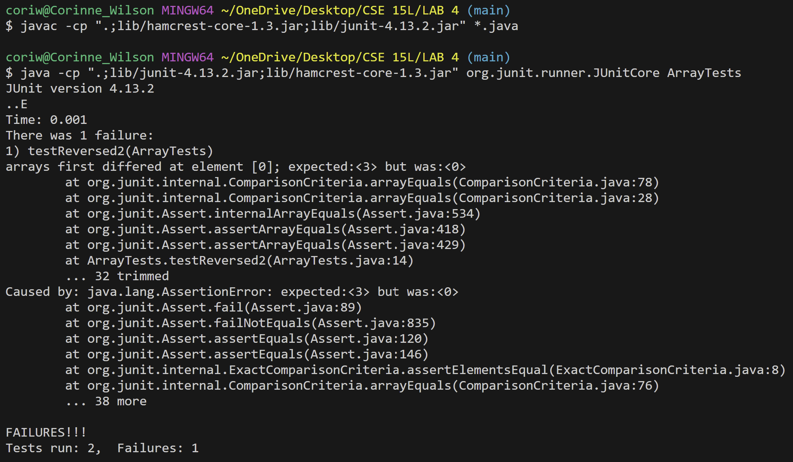
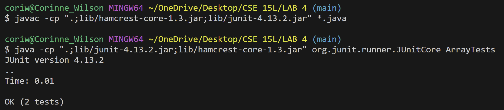

# Lab Report 3

## Part 1: Bugs

Buggy Program (Before)

```
public class ArrayExamples {
  // Returns a *new* array with all the elements of the input array in reversed
  // order
  static int[] reversed(int[] arr) {
    int[] newArray = new int[arr.length];
    for(int i = 0; i < arr.length; i += 1) {
      arr[i] = newArray[arr.length - i - 1];
    }
    return arr;
  }
}
```

Failure-Inducing Input
```
import static org.junit.Assert.*;
import org.junit.*;

public class ArrayTests {
  @Test
  public void testReversed2() {
    int[] input1 = {1, 2, 3};
    assertArrayEquals(new int[]{3, 2, 1}, ArrayExamples.reversed(input1));
  }
}
```

Non Failure-Inucing Input
```
import static org.junit.Assert.*;
import org.junit.*;

public class ArrayTests {
  @Test
  public void testReversed() {
    int[] input1 = { };
    assertArrayEquals(new int[]{ }, ArrayExamples.reversed(input1));
  }
```
Symptom


- As you can see, we are expecting the output of `{3, 2, 1}`. However, the actual output array we are getting has `0` as it's 0 index. In fact, the whole outputed array looks like `{0, 0, 0}`.

---

Buggy Program (After)
```
public class ArrayExamples {
  // Returns a *new* array with all the elements of the input array in reversed
  // order
  static int[] reversed(int[] arr) {
    int[] newArray = new int[arr.length];
    for(int i = 0; i < arr.length; i += 1) {
      newArray[i] = arr[arr.length - i - 1];
    }
    return newArray;
  }
}
```

---
The Fix
- In the Before code, we create a `newArray` with the same length as the input array, `arr`. When creating a new int array, all values in the array are set to 0. So `newArray` would look like `{0, 0, 0}`. Then, we set the forward iterating index elements of `arr` to the backward interating index elements of `newArray`. So `arr` at index 0 would be set to the value of `newArray` at index 2, etc. Thus, `arr` values at all it's indexes would be changed to 0. So, `arr` would look like `{0, 0, 0}` now too. We return `arr`, thus we return the array `{0, 0, 0}`.
- In the After code, we fix this by instead, setting the forward iterating index elements of `newArray` to the backward iterating index elements of `arr`. So `newArray` at index 0 would be set to the value of `arr` at index 2 (3), `newArray` at index 1 would be set to the value of `arr` at index 1 (2), etc. Thus, `newArray` would look like `{3, 2, 1}`. Therefore, instead of returning the original input array, `arr`, we now return the newly created reversed array, `newArray`.
 
Corrected Output


---

## Part 2: Researching Commands
