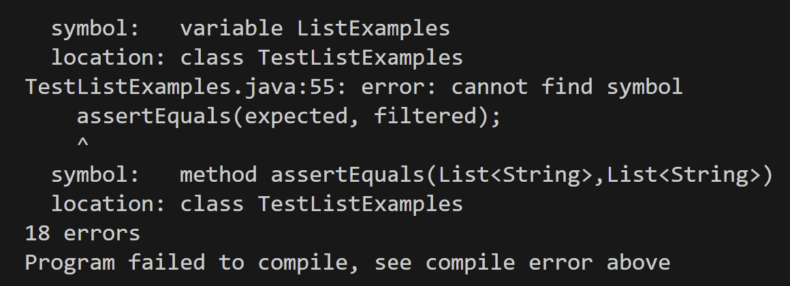
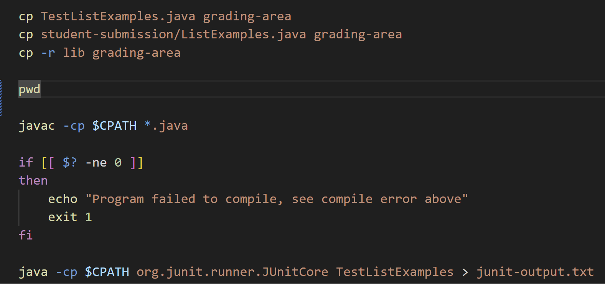
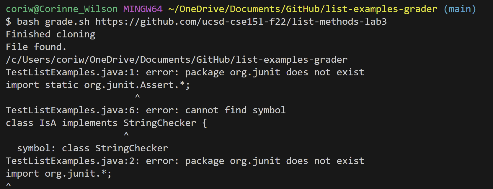
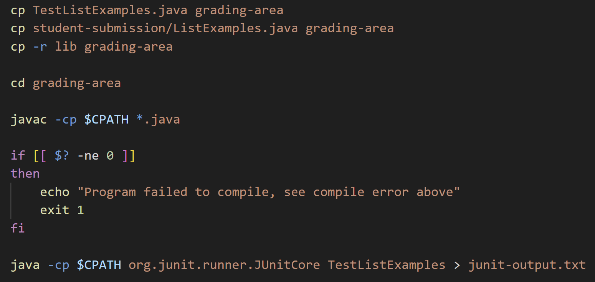
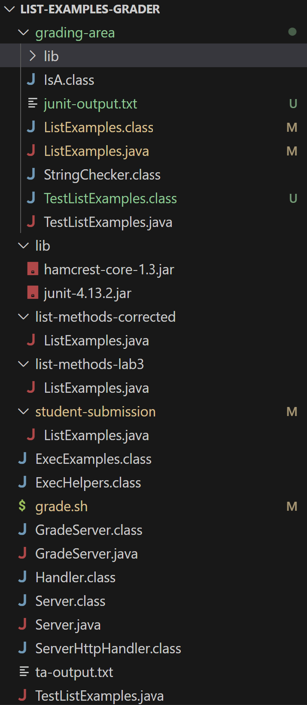
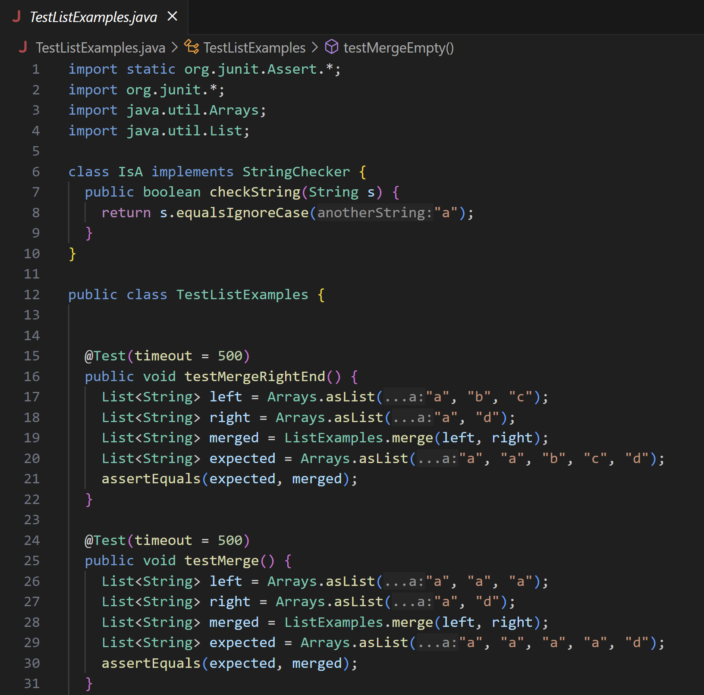
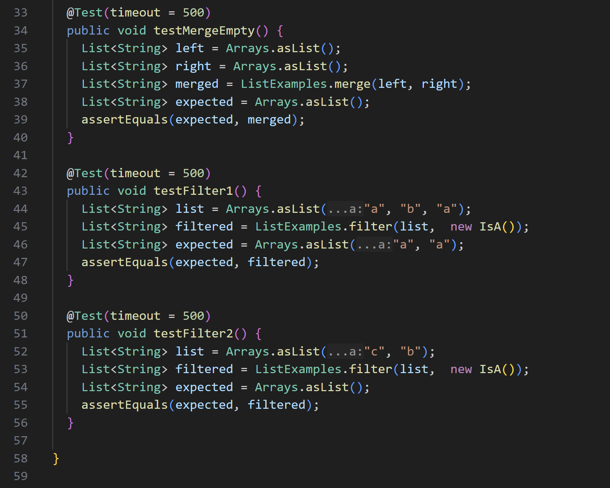
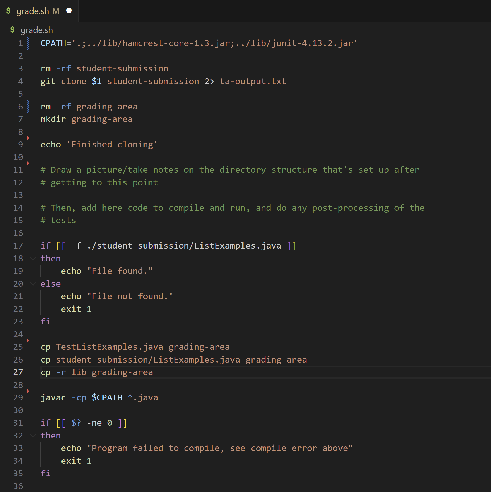
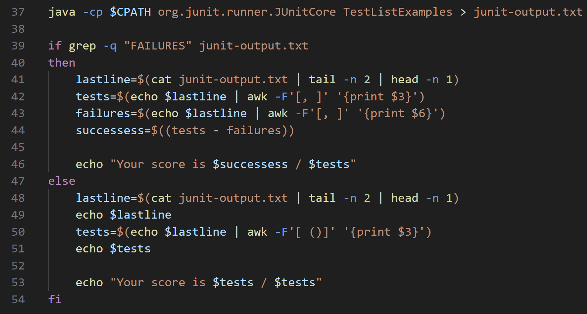

# Lab Report 5

## Part 1: Debugging Scenario
- Student Post:
  - Screenshot of symptom 
  
  
  
  
  
  - Description of guess of the bug
    - Whenever I try to run the `grade.sh` shell script on every one of the sample submissions, I get a message in the terminal indicating the cloning was successful and the students `ListExamples.java` file was found in the `student-submission` directory. However, after that I get a long error message and at the end it says it failed to compile the tests in `TestListExamples.java`. My best guess on why this would be happening is because the lib files `hamcrest-core-1.3.jar` and `junit-4.13.2.jar` cannot be found, thus the tests cannot be compiled. What can I do to fix this?
  
- TA's response:
  - In your shell script, what current working directory are you in when you try to compile your java files, and what is the classpath you are using with this? Ie. Are you in you `student-submission` directory, `list-examples-grader` directory, `grading-area`, or something else. Is your classpath the appropriate relative path to find the two jar files based on the directory you are in? (Hint: you can use `pwd` in your shell script before compiling to see the current directory you are in).
  
- Screenshot/terminal of new output:

  

  

- Description of bug:
  - When trying to compile the java files in the shell script, as you can see in the new output above, we are in the `list-examples-grader` directory. Thus when using the classpath `'.;../lib/hamcrest-core-1.3.jar;../lib/junit-4.13.2.jar'` we are not able to find the two jar files because we `cd` into the outer directory and `lib` is no longer a single layer subdirectory within the current directory.

  

  

- Setup
  - File & Directory structure:
    
    
    
  - Contents of each file before fix:
    - `TestListExamples.java`
      
      

    - `grade.sh`
      
      
 
  - Command line to trigger bug:
    - `bash grade.sh https://github.com/ucsd-cse15l-f22/list-methods-lab3`
  
  - Description of fixing bug:
    - As shown above, to fix this we can `cd` into `grading-area` before compiling so that our working directory and classpath align to produce the right relative path to the two jar files.

    

    

---

Part 2 – Reflection
In a couple of sentences, describe something you learned from your lab experience in the second half of this quarter that you didn't know before. It could be a technical topic we addressed specifically, something cool you found out on your own building on labs, something you learned from a tutor or classmate, and so on. It doesn't have to be specifically related to a lab writeup, we just want to hear about cool things you learned!
