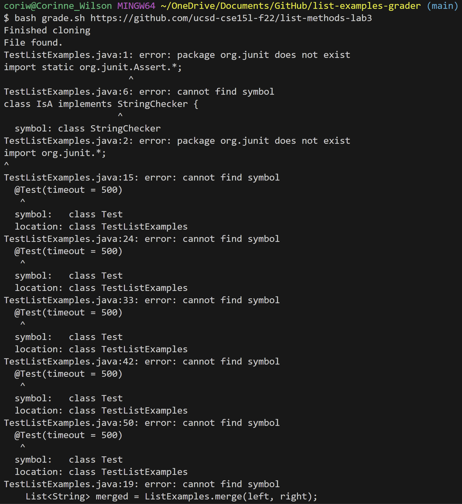

# Lab Report 5

## Part 1: Debugging Scenario
- Student Post:
  - Screenshot of symptom 
  
  
  
  
  
  - Description of guess of the bug
    - Whenever I try to run the grade.sh shell script on every one of the sample submissions, I get a message in the terminal indicating the cloning was successful and the students ListExamples.java was found in the `student-submission` directory. However, after that I get a long error message and at the end it says it failed to compile the tests in `TestListExamples.java`. My best guess on why this would be happening is because the lib files `hamcrest-core-1.3.jar` and `junit-4.13.2.jar` cannot be found, thus the tests cannot be compiled. What can I do to fix this?
  
- TA's response:
  - In your shell script, what current working directory are you in when you try to compile your java files and what is the classpath you are using with this? Ie. Are you in you `student-submission` directory, `list-examples-grader` directory, `grading-area`, or something else. Is your classpath the appropriate path to find the two jar files based on the directory you are in? (Think about which directory you should be in and what path you should use when trying to compile TestListExamples.java).
  
Another screenshot/terminal output showing what information the student got from trying that, and a clear description of what the bug is.
At the end, all the information needed about the setup including:
The file & directory structure needed
The contents of each file before fixing the bug
The full command line (or lines) you ran to trigger the bug
A description of what to edit to fix the bug
You should actually set up and run the scenario from your screenshots. It should involve at least a Java file and a bash script. Describing the bug should involve reading some output at the terminal resulting from running one or more commands. Design an error that produces more interesting output than a single message about a syntax or unbound identifier error – showcase some interesting wrong behavior! Feel free to set this up by cloning and breaking some existing code like the grading script or code from class, or by designing something of your own from scratch, etc.

Part 2 – Reflection
In a couple of sentences, describe something you learned from your lab experience in the second half of this quarter that you didn't know before. It could be a technical topic we addressed specifically, something cool you found out on your own building on labs, something you learned from a tutor or classmate, and so on. It doesn't have to be specifically related to a lab writeup, we just want to hear about cool things you learned!
